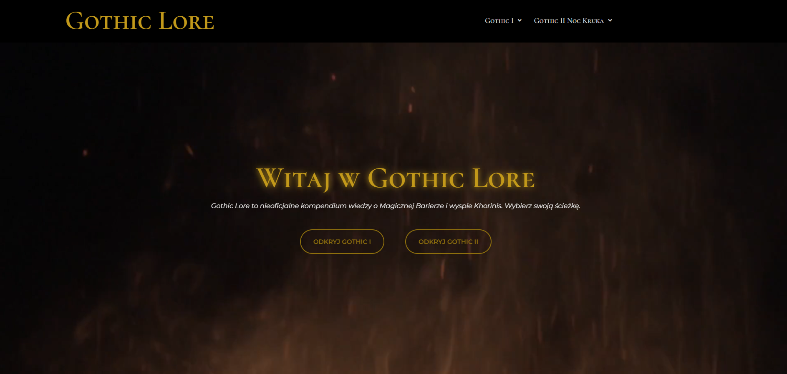

# Gothic Lore — Nieoficjalne Kompendium Gothic I i Gothic II Noc Kruka



> Fanowskie kompendium wiedzy o świecie wykreowanym przez Piranha Bytes. Stworzone przez fanów, dla fanów.

**Live:** [gothic-lore.pl](https://gothic-lore.pl)

---

## O projekcie

**Gothic Lore** to nieoficjalne kompendium wiedzy poświęcone kultowym grom Gothic I oraz Gothic II: Noc Kruka. Projekt powstał z pasji do serii i chęci stworzenia jednego, kompletnego miejsca w polskim internecie, gdzie fani mogą znaleźć szczegółowe informacje o fabule, frakcjach i postaciach obu gier.

Strona zawiera ponad **400 podstron** z unikalnymi opisami — każda postać, frakcja i wątek fabularny posiada własną, ręcznie napisaną stronę. Tworzenie treści było najbardziej czasochłonnym elementem projektu, wymagającym dogłębnej znajomości obu gier.

---

## Funkcjonalności

- **Kompletna baza postaci** — każda postać z Gothic I i Gothic II NK posiada własną podstronę z opisem, frakcją i rolą w fabule
- **Fabuła krok po kroku** — szczegółowe omówienie historii obu gier
- **Encyklopedia frakcji** — Stary Obóz, Nowy Obóz, Bractwo Śniącego, Paladyni, Kupcy, Magowie Wody i inne
- **Panteon bóstw** — Innos, Adanos i Beliar z pełnym opisem ich roli w świecie gry
- **Responsywny design** — strona działa poprawnie na urządzeniach mobilnych i desktopowych
- **Zoptymalizowana pod SEO** — Yoast SEO, Google Search Console, sitemap XML, meta tagi

---

## Stack technologiczny

| Technologia | Zastosowanie |
|---|---|
| **WordPress** | System zarządzania treścią (CMS) |
| **Elementor** | Page builder — budowa layoutów |
| **Własny motyw** | Motyw WordPress napisany od podstaw |
| **HTML / CSS** | Własny kod na podstronach postaci |
| **JavaScript** | Interaktywne elementy na podstronach postaci |
| **Yoast SEO** | Optymalizacja dla wyszukiwarek |
| **Google Analytics** | Śledzenie ruchu na stronie |
| **Google Search Console** | Monitorowanie widoczności w Google |

---

## Struktura strony

```
gothic-lore.pl/
│
├── Gothic I
│   ├── Fabuła            — pełna historia Gothic I
│   ├── Frakcje           — Stary Obóz, Nowy Obóz, Bractwo Śniącego
│   └── Postacie          — 100+ kart postaci z opisami
│
└── Gothic II: Noc Kruka
    ├── Fabuła            — pełna historia Gothic II NK
    ├── Frakcje           — Paladyni, Kupcy, Magowie Wody i inne
    └── Postacie          — 100+ kart postaci z opisami
```

---

## Screenshoty

### Strona główna


### Podstrona Postaci


### Karta postaci


### Widok mobilny


---

## Wyzwania i rozwiązania

**Problem:** Ponad 400 podstron wymagało unikalnych, ręcznie pisanych opisów — ryzyko duplikacji treści i pogorszenia SEO.  
**Rozwiązanie:** Każda podstrona postaci zawiera unikalny opis napisany na podstawie wiedzy o grze, z indywidualnie skonfigurowanymi meta tagami w Yoast SEO.

**Problem:** Migracja strony ze środowiska stagingowego na domenę docelową powodowała błędne linki w bazie danych Elementora.  
**Rozwiązanie:** Wykonanie pełnej zamiany URL w bazie danych za pomocą wtyczki Better Search Replace.

**Problem:** Nowa strona bez historii domeny — niewidoczna w Google.  
**Rozwiązanie:** Kompleksowa konfiguracja SEO: Google Search Console, sitemap XML, optymalizacja meta tagów, frazy kluczowe dla każdej sekcji.

---

## Czas realizacji

Projekt powstawał przez około **2 miesiące** (z przerwami). Najbardziej pracochłonnym etapem było ręczne tworzenie opisów do ponad 400 podstron postaci — każda wymagała indywidualnego podejścia i znajomości lore obu gier.

---

## SEO i widoczność

- Zweryfikowana domena w Google Search Console
- Sitemap XML przesłany do Google
- Meta tytuły i opisy dla wszystkich kluczowych podstron
- Frazy kluczowe: `gothic lore`, `gothic i fabuła`, `gothic 2 noc kruka frakcje` i inne
- Robots.txt skonfigurowany poprawnie
- Google Analytics — śledzenie ruchu

---

## Disclaimer

Wszelkie prawa do marek, nazw i grafik należą do **THQ Nordic / Alkimia Interactive / Piranha Bytes**.  
Projekt ma charakter czysto fanowski i niekomercyjny. Żadne oryginalne zasoby gry nie zostały użyte bez transformacji.

---

## Autor

Projekt stworzony samodzielnie jako fanowski hołd dla serii Gothic.  
Jeśli jesteś fanem — odwiedź [gothic-lore.pl](https://gothic-lore.pl) i wróć do Górniczej Doliny. 
